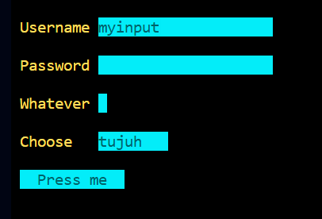

# TVIEWLANG

Create a ready-to-run Go program for TUI-based applications, quicker than a blink.

# Requirements

`go get github.com/rivo/tview`

# Sample code and output

## Sample code

### Form with single input

```
<main( <form( <input[name=myinput] ) )
```


### Form with input, password input, checkbox, combobox, button

```
<main( 
    <form( 
        <input[name=Username] 
        <pass[name=Password]
        <check[Whatever,0]
        <combo[Choose,tujuh,delapan,sembilan]
        <button[Press_me]
    )
)
```


